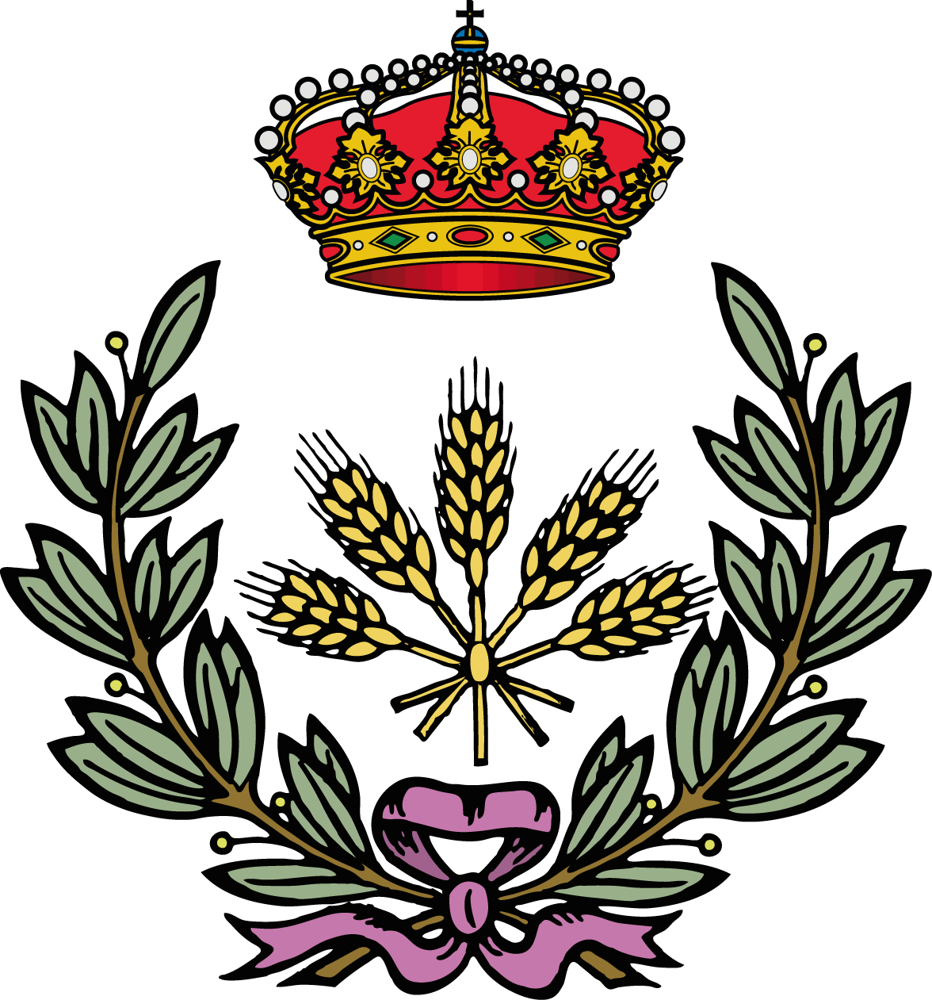

```{r setup, include=FALSE}
knitr::opts_chunk$set(echo=FALSE,results='markup',tidy=FALSE,comment=NA,prompt=FALSE,cache=FALSE,out.width='0.8\\linewidth',message=FALSE,fig.align='center',tidy.opts = list(blank = FALSE, width.cutoff = 50))
options(width=70,digits=3)

## Para evitar los mensajes Package xcolor Warning: Incompatible color definition. Es un arreglo temporal de Yihui el desarrolador de knitr
knitr::knit_hooks$set(document = function(x) {sub('\\usepackage[]{color}', '\\usepackage{xcolor}', x, fixed = TRUE)})
```


## Objetivos de la sesión

- Entender qué es investigación reproducible
- Conocer R Markdown como herramienta clave
- Crear informes dinámicos y automatizados
- Aplicar buenas prácticas reproducibles


## ¿Por qué investigación reproducible?

Problemas habituales:

- Resultados difíciles de reproducir
- Copiar/pegar entre salidas y Word. Propenso a errores
- Versiones inconsistentes de informes

> ¿Podría regeneraar este informe dentro de 2 años?


## ¿Qué es investigación reproducible?

> *Un análisis reproducible es aquel que otra persona (o tú en 6 meses) puede ejecutar y obtener los mismos resultados.*

>

> Datos + código + documentación = mismos resultados

Principios:

- Transparencia
- Trazabilidad
- Automatización
- Reutilización


## El ecosistema de R para reproducibilidad

- R → análisis utilizando código
- RStudio → entorno de programación con R (también Python, JavaScript, C++)
- R Markdown → generaa documentos dinámicos


## ¿Qué es R Markdown?

> R + Markdown + Pandoc

- Markdown es un lenguaje de marcado ligero
- R Markdown combina:
  - Texto
  - Código
  - Resultados
- Pandoc convierte Markdown a otros formatos: HTML, pdf, Doc  
  
- Un solo documento reproducible (fichero.Rmd)

```
fichero.Rmd -> fichero.md -> fichero.html
                             fichero.pdf
                             fichero.docx
```

## Formatos de salida

- HTML
- PDF
- Word
- Presentaciones
- Paneles de control


## Anatomía de un R Markdown

Un documento R Markdown es un documento en formato texto plano con extensión `.Rmd`

El documento contiene:

1. Encabezado YAML
2. Texto (con sintaxis Markdown)
3. Bloques de código R

Todo integrado en un único documento

## Encabezado YAML

- Son metadatos que controlan el formato de salida 
- Se coloca al principio del documento
- Van entre dos lineas con tres signos menos (`---`)


```yaml
---
title: "Informe de análisis"
author: "Investigador/a"
date: "`r Sys.Date()`"
output: html_document
---
```
# Texto con Markdown
## Formato en línea


- *texto en itálica* utilizando `*texto en itálica*`
- **texto en negrilla** utilizando `**texto en negrilla**`
- NH~4~^+^ utilizando `NH~4~^+^`
- Enlaces,  [RStudio](https://www.rstudio.com) utilizando  `[Rstudio](https://www.rstudio.com)` 
- Imagen utilizando `` {width=8%}


## Secciones y subsecciones

Utilizando el símbolo `#` (numeral o almohadilla)

`# Primer nivel`

`## Segundo nivel`

`### Tercer nivel`


## Listas 

``` 
 - Primer elemento
 - Segundo elemento
 - Tercer elemento 
     - Primer elemento
     - Segundo elemento
 - Cuarto elemento
```
La salida:

 - Primer elemento
 - Segundo elemento
 - Tercer elemento 
     - Primer elemento
     - Segundo elemento
 - Cuarto elemento


## Listas numeradas


``` 
 1. Primer elemento
 2. Segundo elemento
 3. Tercer elemento 
     - Primer elemento
     - Segundo elemento
 4. Cuarto elemento
```
La salida:

 1. Primer elemento
 2. Segundo elemento
 3. Tercer elemento 
     - Primer elemento
     - Segundo elemento
 4. Cuarto elemento


## Código R

En un documento R Mardown hay dos formas de introducir código R

- En un bloque de instrucciones (code chunck)
- Insertado en una línea de texto

### Code chunk

````{verbatim echo=TRUE}

```{r, chunck-label,chunk-options}
Lineas de código R
```
````

## Code chunck

Para insertar un bloque de instrucciones en Rstudio 

- Code/Insert Chunk (Alt+Ctrl+I)


- Hay una gran cantidad de opciones para los chunck que pueden verse en [https://yihui.name/knitr/options](https://yihui.name/knitr/options).

Por ejemplo, el code chunck

````{verbatim echo=TRUE}
```{r, label=suma, eval=TRUE,echo=TRUE}
a <- 4
b <- 5
```
````

El resultado:

```{r, label=suma, eval=TRUE,echo=TRUE}
a <- 4
b <- 5

```


## código R en una línea

- La suma de a + b es `` `r knitr::inline_expr("a+b")` ``  

El resultado de la línea al compilar el documento es: La suma de a + b es   `r a+b`  


## Figuras

- Las figuras producidas por el código R se colocarán inmediatamente después del fragmento de código a partir del cual se generaan. 


Por ejemplo, el chunck: 

````{verbatim echo=TRUE}
```{r, fig.cap="Histograma de x"}
x <- rnorm(n=1000)
hist(x,main="")
```
````


---
Generaa la siguiente imagen.


```{r,fig.cap="Histograma de x"}
x <- rnorm(n=1000)
hist(x,main="")
```

## Tablas


- La forma más sencilla de incluir tablas es mediante knitr::kable()
- Solo para objetos que son marco de datos y matrices
- Crea tablas para salidas HTML, PDF y Word 


## 

  - Los títulos de las tablas se pueden incluir pasando el título a la función

Por ejemplo, el chunck

````{verbatim echo=TRUE}
```{r}
knitr::kable(cars[1:5,],caption="5 primeras observaciones 
del marco de datos `cars`")
```
````

##
Genera la siguiente tabla

```{r}
knitr::kable(cars[1:5,],caption="5 primeras observaciones
del marco de datos `cars`")
```

## Enlaces externos

 - Initial steps toward reproducible research. [https://kbroman.org/steps2rr/](https://kbroman.org/steps2rr/) 
 
 Karl Broman es profesor del Departamento de Biostatistics & Medical Informatics  de la Universidad de Wisconsin-Madison
 
## 

 - R Markdown: The Definitive Guide [https://bookdown.org/yihui/rmarkdown/](https://bookdown.org/yihui/rmarkdown/). Yihui Xie, J. J. Allaire, G. Grolemund. 2023 

 - R Markdown Cookbook[https://bookdown.org/yihui/rmarkdown-cookbook/](https://bookdown.org/yihui/rmarkdown-cookbook/). Yihui Xie, C. Dervieux, E. Riederer. 2025
 
 Yihui Xie [https://yihui.org](https://yihui.org) es ingeniero de software en RStudio [https://www.rstudio.com](https://www.rstudio.com).
 
 Es autor de varios paquetes de R entre ellos **knitr**. También es coautor del  paquete **rmarkdown**.